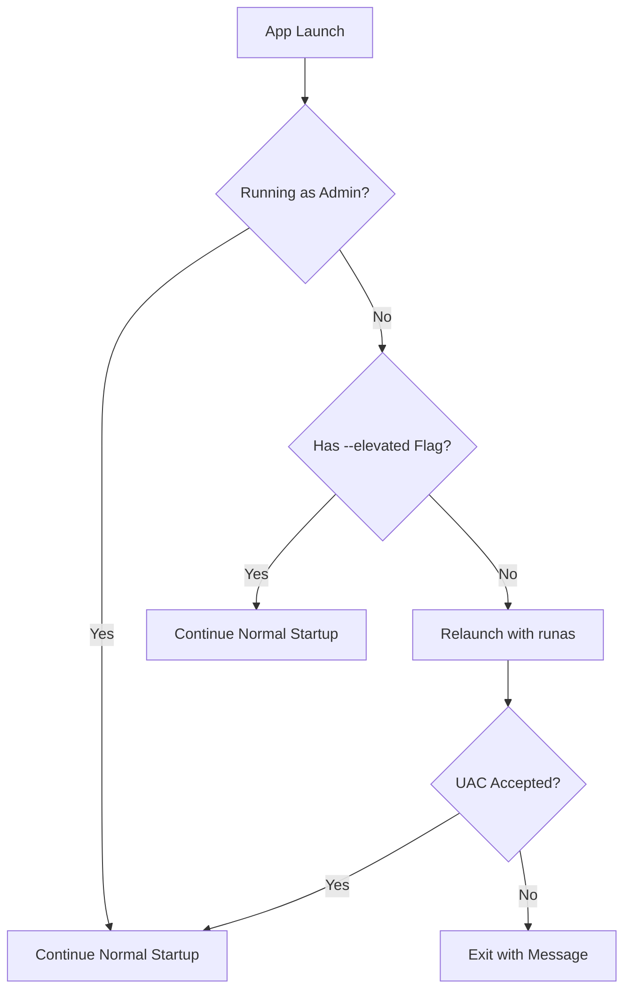

# Screen Shield v1.1.0 - Admin Elevation Plan

## Overview
Update Screen Shield from version 1.0.0 to 1.1.0 with enforced administrative privileges on launch.

## Current State Analysis
- **app.manifest**: Already contains `<requestedExecutionLevel level="requireAdministrator" uiAccess="false" />` (Primary method ✓)
- **package.json**: Version 1.0.0, NSIS config without explicit PrivilegesRequired
- **main.js**: Has `isElevated()` function but only checks for UI warning, doesn't enforce elevation
- **CHANGELOG.md**: Latest entry is [1.00.25] - needs 1.1.0 entry

---

## Implementation Plan

### 1. Update package.json version
- Change `"version": "1.0.0"` to `"version": "1.1.0"`
- Add `"PrivilegesRequired": "admin"` to NSIS build config

### 2. Update app.manifest version
- Change `assemblyIdentity version="1.0.0.0"` to `version="1.1.0.0"`

### 3. Add Runtime Elevation Check (Secondary Method)
Add to main.js before app.whenReady():

```javascript
// Runtime elevation check - secondary method
const ELEVATED_FLAG = '--elevated'

function isRunningAsAdmin() {
  try {
    execSync('fltmc', { stdio: 'ignore' })
    return true
  } catch {
    return false
  }
}

function restartAsAdmin() {
  const exePath = process.execPath
  const appArgs = [...process.argv.slice(1), ELEVATED_FLAG]
  const child = spawn(exePath, appArgs, {
    detached: true,
    stdio: 'ignore',
    shell: true,
    windowsHide: true,
  })
  child.unref()
  app.quit()
}

// Check for elevation before app ready
if (!isRunningAsAdmin() && !process.argv.includes(ELEVATED_FLAG)) {
  restartAsAdmin()
}
```

### 4. Handle --elevated Flag
- Add flag parsing to prevent infinite relaunch loops
- After successful elevation, continue normal startup

### 5. Add CHANGELOG Entry
```
## [1.1.0] - 2026-03-21

### Added
- **Forced administrator privilege requirement on app launch** — the application now enforces admin rights at startup via:
  - App manifest (`app.manifest`) with `<requestedExecutionLevel level="requireAdministrator" uiAccess="false" />` for both portable and installed builds
  - Runtime elevation check (`main.js`) that detects non-admin launches and re-invokes self with elevated privileges using the "runas" verb
  - NSIS installer now explicitly requests admin privileges (`PrivilegesRequired=admin`)
  - If the user cancels the UAC prompt, the app exits gracefully with a clear message: "This application requires administrator privileges to run."
```

### 6. NSIS Installer Configuration
Add to package.json build.nsis:
```json
"nsis": {
  "oneClick": false,
  "allowToChangeInstallationDirectory": true,
  "PrivilegesRequired": "admin",
  ...
}
```

---

## Edge Case Handling

| Scenario | Behavior |
|----------|----------|
| User cancels UAC prompt | Exit gracefully with message "This application requires administrator privileges to run." |
| Already running as admin | Normal startup, no relaunch |
| Relaunch with --elevated flag | Skip re-elevation check to prevent infinite loop |
| Portable EXE launch | Same behavior as installed EXE (manifest applies to both) |
| Background/tray launch | Elevation still required - tray icon appears after elevation |
| Auto-start task | Runs elevated via Task Scheduler highestAvailable setting |

---

## Testing Checklist

- [ ] Launch portable EXE as standard user → UAC prompt appears
- [ ] Launch portable EXE as admin → runs normally, no relaunch loop
- [ ] Cancel UAC → exits cleanly with message
- [ ] Installed EXE → same behavior as portable
- [ ] Startup task → runs elevated
- [ ] Verify CHANGELOG entry is present
- [ ] Verify version shows 1.1.0 in app

---

## Mermaid Workflow



---

## Files to Modify

| File | Changes |
|------|---------|
| package.json | Version 1.1.0, PrivilegesRequired: admin |
| app.manifest | Version 1.1.0.0 (already has requireAdministrator) |
| main.js | Add runtime elevation check + --elevated flag handling |
| CHANGELOG.md | Add 1.1.0 entry |

---

## Notes

- The app.manifest already has `<requestedExecutionLevel level="requireAdministrator" />` - this is the primary method that works for both portable and installed EXEs
- The runtime elevation check is a secondary/fallback method that provides additional robustness
- The Inno Setup script (inno.iss) appears to be legacy from the Invisiwind project and is not used by the current electron-builder setup
